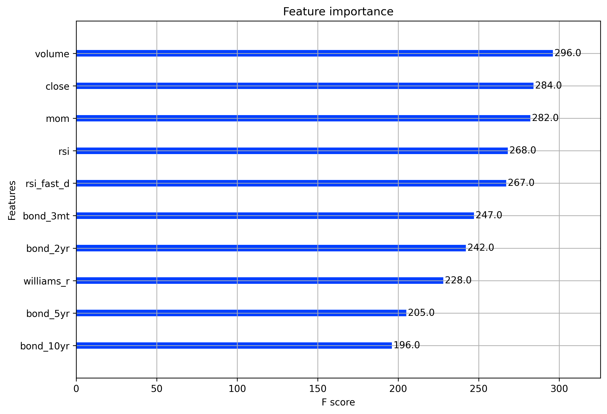

# Predicting Daily SPY Prices with a Hybrid CNN-LSTM Model Architecture
Predicting the prices of the S&amp;P 500 with a convolutional neural network coupled with long short-term memory.

## Usage

### Environment

Requires Python >= 3.8.

Activate your virtual environment. For example, with Anaconda:
```sh
conda activate <env>
```

### Dependencies

These installations are required to run the analysis. Newer package versions can be used, but be aware that library updates may cause code errors in the notebook.

```sh
pip install numpy==1.20.3
pip install pandas==1.3.4
pip install matplotlib==3.5.2
pip install plotly==5.8.0
pip install scikit-learn==0.24.2
pip install imbalanced-learn==0.9.1
pip install tensorflow==2.9.1
pip install xgboost==1.5.1
pip install finnhub-python==2.4.13
pip install yfinance==0.1.74
pip install TA-Lib==0.4.24
pip install tensorflow==2.9.2
pip install tensorflow==2.9.2
pip install h5py==3.7.0
pip install streamlit==1.11.1
```

### Run

Run the notebooks in numerical order using your Jupyter Notebook editor of choice.

## Description

This is a research project comparing the performance of a Convolutional Neural Network (CNN) to an XGBoost classifier in the task of predicting next-day closing prices of the S&P 500 Index. The goal of the project is to determine the fitness of these models to the task of time series prediction, and learn some things along the way.

## Data collection and feature engineering

Financial data was retrieved with the `yfinance` python library and technical indicators were created using the Python implementation of `TA-Lib`. A total of 74 variables were used in the dataset including major global indices, t-bonds, futures, large US companies, commodities, USD currency pairs, and indicators like RSI, momentum, bollinger bands, MACD, and EMA.

The purpose of having such a diverse and widespread set of quantitative variables is primarily for the CNN to be able to choose important features from a large set. Secondarily, feature importance can be viewed visually with XGBoost, allowing us to omit the variables that do not strongly correlate to the label.

### All features

This is a list of all features, rated by importance by the XGBoost classifier. Since many of the features are not strongly correlated, we should find a threshold of the right amount of features to choose.


### Selected features (for XGBoost)

A threshold was found using XGBoost's `SelectFromModel` class in a loop with progressively changing threshold values. These 10 features were optimal for the XGBoost model.



## Results

### CNN

Although the CNN yielded acceptable evaluation metrics, it was not an effective predictor. As can be seen in the confusion matrix, the CNN predicted only values of `1`. Balancing the data with oversampling had no effect on the CNN.

#### Possible solution

It's possible that the CNN needed more data to train on in order to learn better.


### XGBoost Classifier

The XGBoost classifier showed promise in that it attempted a balanced set of predictions. Although the evaluation metrics score lower than the CNN, the XGBoost model still outperforms.


## Conclusion

Neural networks like CNNs are probably not well suited to time series analysis and inference due to their lack of memory. The XGBoost classifier was much stronger and simpler to use and was more transparent in evaluation.

Next steps are to build an ensemble model containing regressors, tree-based gradient boosters, and classifiers that can all weigh in on predictions.